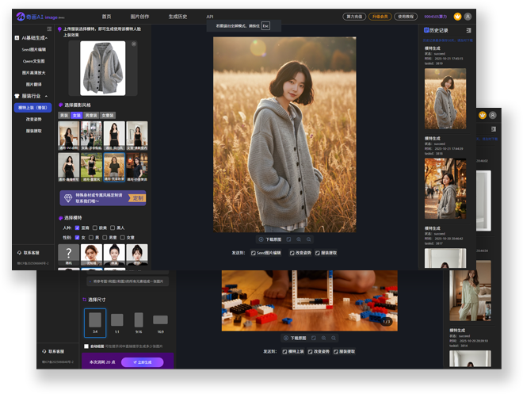
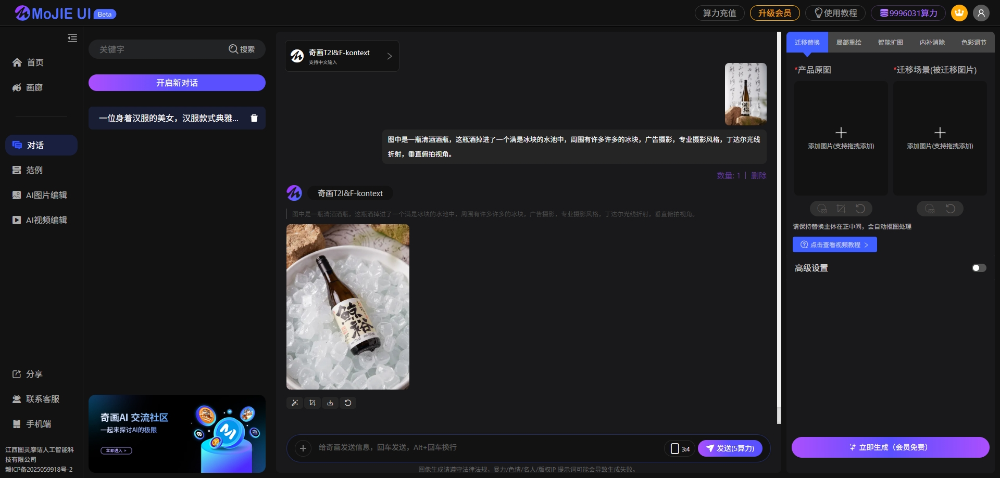

<div align="center">
 
</div>

<div align="center">
[<a href="/README_EN.md">English</a>] | [<a href="/README.md">中文</a>]
</div>


## 项目概述：以comfyui为后端的图像处理UI框架
Mojie-UI已正式更名为奇画AI-2.0(beta)，奇画AI是摩诘智影旗下研发的AI商用系统，开箱即用，操作简单友好，效果更直观，可扩展性极佳，也适合电商/广告/创意类用户直接使用。平台已对接国内外主流大厂模型。支持模型微调定制开发，支持对接comfyui/扣子等主流工作流为后端处理，支持企业级部署，二次应用开发和OEM代理。能够进行多任务处理，用户支付，积分充值，分享赚米等。详情可以联系我们。
原有的MoJie-UI源码开源，但不再维护。


微信：mojieaigc
访问地址：https://www.qihuaimage.com/
API调用主站地址：https://www.mojieaigc.com/




## 以下为原MoJie-UI的详细说明



## 视频说明：
[B站-摩诘AI](https://www.bilibili.com/video/BV1MFNtzREZR/?vd_source=25d3add966daa64cbb811354319ec18d)
wechat:mojieaigc

## 项目亮点：
- 前端架构采用Vue.js
- 后端服务 python-diango
- 使用redis作为任务缓存，将任务请求依次发送至comfyui
- 支持多任务多GPU负载均衡。
- 采用对话式交互+常用功能，支持拖拽，交互体验极佳。
- 系统开发完善，非常适合快速部署，迅速商业化。
- 支持快速/慢速队列
- 完整的充值算力积分逻辑

## 演示地址
https://www.qihuaimage.com/
注意：API可以正常使用，comfyui部分未链接，没钱买GPU

# MJApplication_server_new 项目部署文档

## 环境准备
### 系统要求
- 支持 Linux
- 建议使用 8GB 以上内存的服务器或计算机。
- GPU推荐A10或L20，或4090以上。

### 软件依赖
- **Python 3.7 及以上版本**：用于运行项目代码。
- **Redis**：用于队列服务和缓存。
- **MySQL**：用于数据存储。
- **ComfyUI**：用于图像生成和处理。
- 详情查看requirements.txt

## ComfyUI 部署
### 下载和安装 ComfyUI
从 ComfyUI 的官方仓库（如 GitHub）下载最新版本的代码，并解压到相关目录。
请将comfyui单独部署在GPU上，工作流路径在
```bash
/mojie-server/comfyui
```

修改 ComfyUI 的启动命令。： 
- 为提升安全性，comfyui需安装comfyui-login https://github.com/liusida/ComfyUI-Login
- 在终端中进入 ComfyUI 的目录，执行以下命令启动服务：
```bash
python main.py --listen 0.0.0.0 --port 1004 --disable-metadata
```
也可以开启后台运行
```bash
nohup python main.py --listen 0.0.0.0 --port 1004 --disable-metadata > log.txt 2>&1 &
```
listen是端口监听，prot是端口号，disable-metadata是关闭图像工作流数据输出
确保服务正常启动。


## Redis 与 MySQL 容器化部署

### 启动容器
在项目根目录下，执行以下命令启动 Redis 和 MySQL 容器：
- **Linux**：启动 Redis 和 MySQL 容器。
```bash
docker-compose up -d
```
### 4.2 验证容器状态
执行以下命令查看容器状态：
```bash
docker-compose ps
```
确保 Redis 和 MySQL 容器正常运行。

## 抠图服务配置
抠图是万物迁移的辅助功能，根据原工作流设计需要把图片主体扣出来并自动改成1024X1280尺寸。
根据操作系统的不同，选择合适的安装方式：
### 下载模型
通过下方地址下载模型文件，放在BiRefNet目录下：
```bash
https://huggingface.co/yiwangsimple/BiRefNet-general-epoch_244/tree/main
```
### 5.2 安装 Python 依赖
在BiRefNet目录下，执行以下命令安装 Python 依赖：
```bash
pip install -r requirements.txt
```
### 5.3 运行 flask 项目
在项目根目录下，执行以下命令启动 Django 项目：
```bash
python app.py --listen 0.0.0.0 --port 8000
```

## 后端项目配置
### 克隆项目代码
从代码仓库克隆项目代码到本地：
```bash
git clone <项目仓库地址>
cd mjAI/MJApplication_server_new
```

### 安装 Python 依赖
在项目根目录下，执行以下命令安装 Python 依赖：
```bash
pip install -r requirements.txt
```

### 配置项目参数
打开 `config/config.ini` 文件，确保以下基础配置项正确，其他的根据需要自行配置：
```ini
[mysql]
name = MJApplicationDate
user = root
password = mojie0303
host = 127.0.0.1
port = 3306

[redis]
locate = redis://127.0.0.1:6379/6
```

## 启动项目
### 生成并执行迁移
Django 内置了manage.py工具，用于处理数据库迁移：：
```bash
python manage.py makemigrations
python manage.py migrate
```

### 运行 Django 项目
在项目根目录下，执行以下命令启动 Django 项目：
```bash
python manage.py runserver 0.0.0.0:9152
```

## 前端项目
前端项目位于mojie-front目录下，使用Vue3+Vite进行开发。
### 安装依赖

```bash
yarn install
```

### 开发环境

```bash
# 启动开发服务器
yarn dev

# 启动开发服务器并指定端口
yarn dev --port 8080

# 启动开发服务器并启用 HTTPS
yarn dev --https
```

### 生产环境

```bash
# 构建生产环境
yarn build

# 预览生产环境
yarn preview
```
## 九、后台项目（可选）
### 安装依赖
前端项目位于mojie-front-back目录下。
```bash
yarn install
```

### 开发环境

```bash
# 启动开发服务器
yarn dev

# 启动开发服务器并指定端口
yarn dev --port 8080

# 启动开发服务器并启用 HTTPS
yarn dev --https
```

### 生产环境

```bash
# 构建生产环境
yarn build

# 预览生产环境
yarn preview
```
