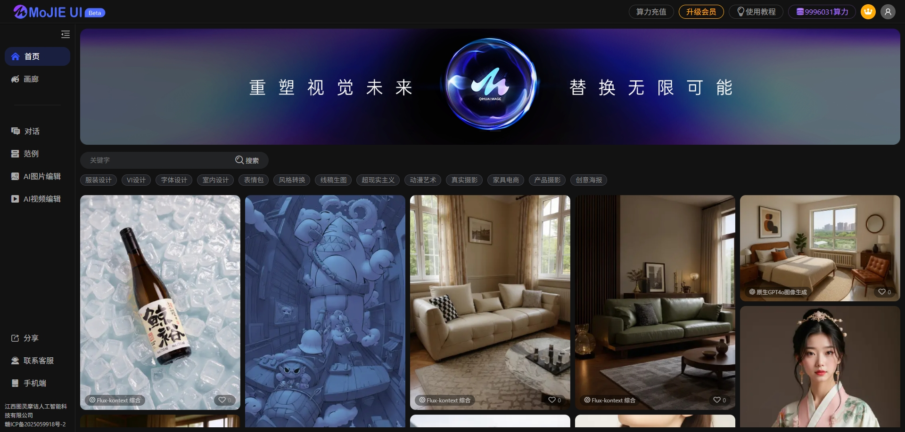

<div align="center">
 
</div>

<div align="center">
[<a href="readme_en.md">English</a>] | [<a href="readme.md">中文</a>]
</div>

## Project Overview: Image Processing UI Framework Based on ComfyUI
MoJie-UI is an image generation UI and server framework based on ComfyUI as the backend. It uses Redis for queue service management, Vue framework for the frontend, and integrates GPT4O, FLUX-Kkontext, and Instant Dream API. It supports multi-task processing, user payments, points recharge, and more. This project depends on services such as ComfyUI, Redis, and MySQL.




## Video Introduction:
[BiliBili-MoJie AI](https://space.bilibili.com/483532108)

## Project Highlights:
- Frontend architecture using Vue.js
- Backend service using Python-Django
- Uses Redis as task cache, sending task requests sequentially to ComfyUI
- Supports multi-task and multi-GPU load balancing
- Features conversational interaction + common functions, supports drag and drop, excellent interactive experience
- Well-developed system, perfect for quick deployment and rapid commercialization
- Supports fast/slow queues
- Complete recharge computing power points logic

## Demo Address
https://www.qihuaimage.com/
Note: API can be used normally, ComfyUI part is not connected (no GPU budget)

# MJApplication_server_new Project Deployment Documentation

## Environment Preparation
### System Requirements
- Supports Linux
- Recommended server or computer with 8GB+ memory
- GPU recommendation: A10 or L20, or 4090 and above

### Software Dependencies
- **Python 3.7 and above**: For running project code
- **Redis**: For queue service and caching
- **MySQL**: For data storage
- **ComfyUI**: For image generation and processing
- See requirements.txt for details

## ComfyUI Deployment
### Download and Install ComfyUI
Download the latest version of the code from ComfyUI's official repository (e.g., GitHub) and extract to the relevant directory.
Please deploy ComfyUI separately on GPU, workflow path is in:
```bash
/mojie-server/comfyui