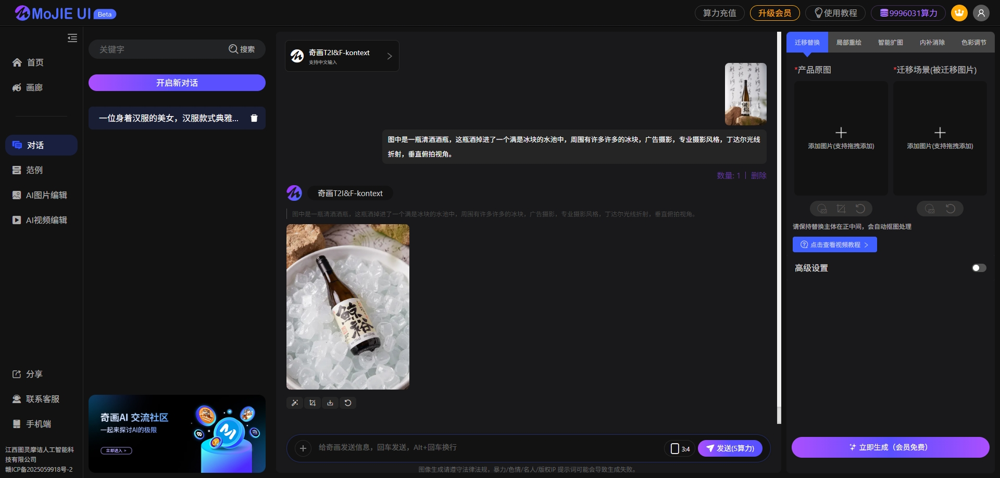

<div align="center">
 
</div>

<div align="center">
[<a href="readme_en.md">English</a>] | [<a href="readme.md">中文</a>]
</div>

## Project Overview: Image Processing UI Framework Based on ComfyUI
MoJie-UI is an image generation UI and server framework based on ComfyUI as the backend. It uses Redis for queue service management, Vue framework for the frontend, and integrates GPT4O, FLUX-Kkontext, and Instant Dream API. It supports multi-task processing, user payments, points recharge, and more. This project depends on services such as ComfyUI, Redis, and MySQL.




## Video Introduction:
[BiliBili-MoJie AI](https://space.bilibili.com/483532108)

## Project Highlights:
- Frontend architecture using Vue.js
- Backend service using Python-Django
- Uses Redis as task cache, sending task requests sequentially to ComfyUI
- Supports multi-task and multi-GPU load balancing
- Features conversational interaction + common functions, supports drag and drop, excellent interactive experience
- Well-developed system, perfect for quick deployment and rapid commercialization
- Supports fast/slow queues
- Complete recharge computing power points logic

## Demo Address
https://www.qihuaimage.com/
Note: API can be used normally, ComfyUI part is not connected (no GPU budget)

# MJApplication_server_new Project Deployment Documentation

## Environment Preparation
### System Requirements
- Supports Linux
- Recommended server or computer with 8GB+ memory
- GPU recommendation: A10 or L20, or 4090 and above

### Software Dependencies
- **Python 3.7 and above**: For running project code
- **Redis**: For queue service and caching
- **MySQL**: For data storage
- **ComfyUI**: For image generation and processing
- See requirements.txt for details

## ComfyUI Deployment
### Download and Install ComfyUI
Download the latest version of the code from ComfyUI's official repository (e.g., GitHub) and extract to the relevant directory.
Please deploy ComfyUI separately on GPU, workflow path is in:
```bash
/mojie-server/comfyui
```
Modify ComfyUI startup command:

- For enhanced security, ComfyUI needs to install comfyui-login https://github.com/liusida/ComfyUI-Login
- In terminal, enter ComfyUI directory and execute the following command to start service:
```
python main.py --listen 0.0.0.0 --port 
1004 --disable-metadata
```
Or run in background:

```
nohup python main.py --listen 0.0.0.0 
--port 1004 --disable-metadata > log.
txt 2>&1 &
```
listen is port monitoring, port is port number, disable-metadata is to disable image workflow data output
Ensure service starts normally.

## Redis and MySQL Containerized Deployment
### Start Containers
In project root directory, execute following command to start Redis and MySQL containers:

- Linux : Start Redis and MySQL containers
### 4.2 Verify Container Status
Execute following command to check container status:

Ensure Redis and MySQL containers are running normally.

## Image Matting Service Configuration
Image matting is an auxiliary function for universal migration. According to original workflow design, it needs to extract image subject and automatically change to 1024X1280 size.
Choose appropriate installation method based on operating system:

### Download Model
Download model files through address below, place in BiRefNet directory:

### 5.2 Install Python Dependencies
In BiRefNet directory, execute following command to install Python dependencies:

### 5.3 Run Flask Project
In project root directory, execute following command to start Django project:

## Backend Project Configuration
### Clone Project Code
Clone project code from code repository to local:

### Install Python Dependencies
In project root directory, execute following command to install Python dependencies:

### Configure Project Parameters
Open config/config.ini file, ensure following basic configuration items are correct, configure others as needed:

## Start Project
### Generate and Execute Migration
Django has built-in manage.py tool for handling database migrations:

### Run Django Project
In project root directory, execute following command to start Django project:

## Frontend Project
Frontend project is located in mojie-front directory, developed using Vue3+Vite.

### Install Dependencies
### Development Environment
### Production Environment
## IX. Backend Management Project (Optional)
### Install Dependencies
Frontend project is located in mojie-front-back directory.

```
yarn install
```
### Development Environment
```
# Start development server
yarn dev

# Start development server and specify port
yarn dev --port 8080

# Start development server and enable HTTPS
yarn dev --https
```
### Production Environment
```
# Build production environment
yarn build

# Preview production environment
yarn preview
```